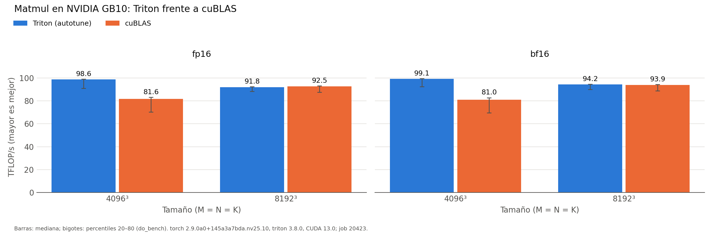

# Baseline matmul (hennessy-580)

Generado automáticamente desde `results/hennessy-580/run_matmul/20260930-141608_job20423/`.

| dtype | M×N×K | Config. Triton (BM×BN×BK, warps, stages) | Triton (ms) | Triton (TFLOP/s) | cuBLAS (ms) | cuBLAS (TFLOP/s) | Triton/cuBLAS |
|:---|:---|:---|---:|---:|---:|---:|---:|
| fp16 | 4096×4096×4096 | 128×128×32, w4, s4 | 1.394 | 98.6 | 1.683 | 81.6 | 120.8% |
| fp16 | 8192×8192×8192 | 128×256×64, w8, s3 | 11.979 | 91.8 | 11.886 | 92.5 | 99.2% |
| bf16 | 4096×4096×4096 | 128×128×32, w4, s4 | 1.387 | 99.1 | 1.698 | 81.0 | 122.4% |
| bf16 | 8192×8192×8192 | 128×256×64, w8, s3 | 11.671 | 94.2 | 11.706 | 93.9 | 100.3% |

*NVIDIA GB10 (sm_121), torch 2.9.0a0+145a3a7bda.nv25.10, triton 3.8.0, CUDA 13.0; job 20423, 2026-09-30T14:16:08. Mediana de triton.testing.do_bench.*

Tensor cores (PTX Triton): `mma.sync.aligned.m16n8k16.row.col.f32.bf16.bf16.f32`, `mma.sync.aligned.m16n8k16.row.col.f32.f16.f16.f32`
