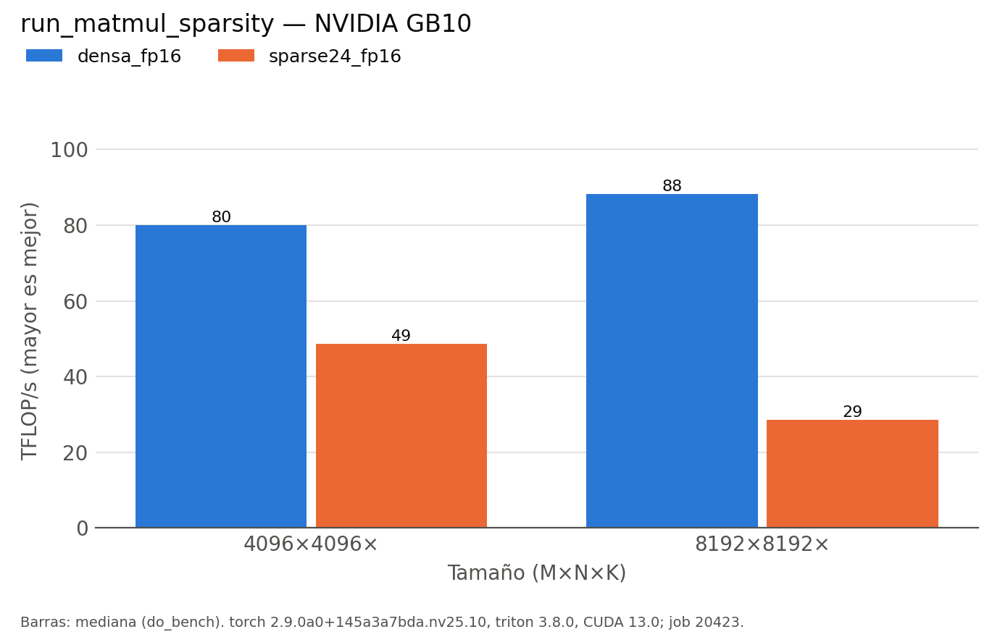

# run_matmul_sparsity (hennessy-580)

Generado automáticamente desde `results/hennessy-580/run_matmul_sparsity/20260930-141629_job20423/`.

| variante | M | N | K | error_rel | ms | ms_p20 | ms_p80 | tflops | kernel |
|:---|:---|:---|:---|:---|:---|:---|:---|:---|:---|
| densa_fp16 | 4096 | 4096 |  | 0 | 1.7168 | 1.6861 | 1.992 | 80.06 | void cutlass::Kernel2<cutlass_80_tensorop_f16_s16816gemm_relu_f16_128x256_32x3_nn_align8>(cutlass_80_tensorop_f16_s16816gemm_relu_f16_128x256_32x3_nn_align8::Params) |
| sparse24_fp16 | 4096 | 4096 |  | 4e-05 | 2.8235 | 2.7672 | 2.8826 | 48.68 | sm80_xmma_sparse_gemm_f16f16_f16f32_f32_tt_t_tilesize128x128x64_stage3_warpsize2x2x1_sptensor16x8x32_execute_kernel_5x_cusparselt |
| densa_fp16 | 8192 | 8192 |  | 0 | 12.4518 | 12.331 | 12.7887 | 88.3 | nvjet_sm121_hsh_mma_128x208x64_2_32x104x64_tmaAB_bz_NNNN |
| sparse24_fp16 | 8192 | 8192 |  | 6e-05 | 38.463 | 38.0302 | 38.6728 | 28.59 | sm80_xmma_sparse_gemm_f16f16_f16f32_f32_tt_t_tilesize128x128x64_stage3_warpsize2x2x1_sptensor16x8x32_execute_kernel_5x_cusparselt |

*NVIDIA GB10 (sm_121), torch 2.9.0a0+145a3a7bda.nv25.10, triton 3.8.0, CUDA 13.0; job 20423, 2026-09-30T14:16:29. Mediana de triton.testing.do_bench.*
