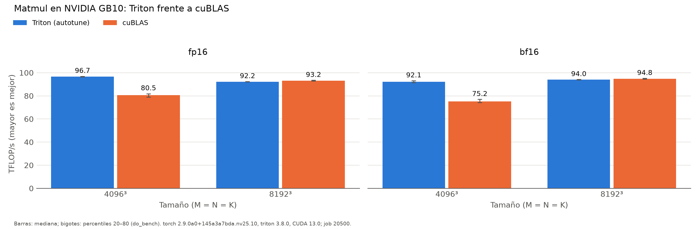

# Baseline matmul (hennessy)

Generado automáticamente desde `results/hennessy/run_matmul/20261002-091508_job20500/`.

| dtype | M×N×K | Config. Triton (BM×BN×BK, warps, stages) | Triton (ms) | Triton (TFLOP/s) | cuBLAS (ms) | cuBLAS (TFLOP/s) | Triton/cuBLAS |
|:---|:---|:---|---:|---:|---:|---:|---:|
| fp16 | 4096×4096×4096 | 128×128×32, w4, s4 | 1.421 | 96.7 | 1.707 | 80.5 | 120.1% |
| fp16 | 8192×8192×8192 | 128×256×64, w8, s3 | 11.920 | 92.2 | 11.799 | 93.2 | 99.0% |
| bf16 | 4096×4096×4096 | 128×128×32, w4, s3 | 1.492 | 92.1 | 1.827 | 75.2 | 122.4% |
| bf16 | 8192×8192×8192 | 128×256×64, w8, s3 | 11.699 | 94.0 | 11.601 | 94.8 | 99.2% |

*NVIDIA GB10 (sm_121), torch 2.9.0a0+145a3a7bda.nv25.10, triton 3.8.0, CUDA 13.0; job 20500, 2026-10-02T09:15:08. Mediana de triton.testing.do_bench.*

Tensor cores (PTX Triton): `mma.sync.aligned.m16n8k16.row.col.f32.bf16.bf16.f32`, `mma.sync.aligned.m16n8k16.row.col.f32.f16.f16.f32`
