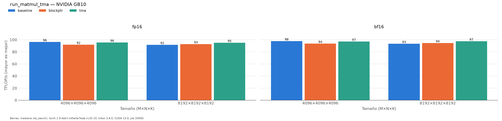

# run_matmul_tma (hennessy)

Generado automáticamente desde `results/hennessy/run_matmul_tma/20261002-092038_job20500/`.

| variante | dtype | M | N | K | BLOCK_SIZE_M | BLOCK_SIZE_N | BLOCK_SIZE_K | GROUP_SIZE_M | num_warps | num_stages | carga | usa_tma | autotune_s | ms | ms_p20 | ms_p80 | tflops | gbs | mma |
|:---|:---|:---|:---|:---|:---|:---|:---|:---|:---|:---|:---|:---|:---|:---|:---|:---|:---|:---|:---|
| baseline | fp16 | 4096 | 4096 | 4096 | 128 | 128 | 32 | 8 | 4 | 4 | cp.async | False | 7.8 | 1.4276 | 1.4244 | 1.4314 | 96.27 | 70.5 | mma.sync.aligned.m16n8k16.row.col.f32.f16.f16.f32 |
| blockptr | fp16 | 4096 | 4096 | 4096 | 128 | 128 | 32 | 8 | 4 | 3 | cp.async | False | 17.1 | 1.4959 | 1.4817 | 1.5102 | 91.87 | 67.3 | mma.sync.aligned.m16n8k16.row.col.f32.f16.f16.f32 |
| tma | fp16 | 4096 | 4096 | 4096 | 128 | 128 | 32 | 8 | 8 | 4 | TMA | True | 20.7 | 1.4389 | 1.4357 | 1.4428 | 95.52 | 70 | mma.sync.aligned.m16n8k16.row.col.f32.f16.f16.f32 |
| baseline | fp16 | 8192 | 8192 | 8192 | 128 | 256 | 64 | 8 | 8 | 3 | cp.async | False | 13.5 | 12.0063 | 11.991 | 12.0224 | 91.58 | 33.5 | mma.sync.aligned.m16n8k16.row.col.f32.f16.f16.f32 |
| blockptr | fp16 | 8192 | 8192 | 8192 | 128 | 256 | 64 | 8 | 8 | 3 | cp.async | False | 34.3 | 11.8487 | 11.8404 | 11.8663 | 92.8 | 34 | mma.sync.aligned.m16n8k16.row.col.f32.f16.f16.f32 |
| tma | fp16 | 8192 | 8192 | 8192 | 128 | 128 | 32 | 8 | 4 | 4 | TMA | True | 63.9 | 11.5805 | 11.5506 | 11.6042 | 94.95 | 34.8 | mma.sync.aligned.m16n8k16.row.col.f32.f16.f16.f32 |
| baseline | bf16 | 4096 | 4096 | 4096 | 128 | 128 | 32 | 8 | 4 | 4 | cp.async | False | 7.5 | 1.407 | 1.4039 | 1.41 | 97.68 | 71.5 | mma.sync.aligned.m16n8k16.row.col.f32.bf16.bf16.f32 |
| blockptr | bf16 | 4096 | 4096 | 4096 | 128 | 128 | 32 | 8 | 4 | 4 | cp.async | False | 17.1 | 1.4695 | 1.4602 | 1.4777 | 93.53 | 68.5 | mma.sync.aligned.m16n8k16.row.col.f32.bf16.bf16.f32 |
| tma | bf16 | 4096 | 4096 | 4096 | 128 | 128 | 32 | 8 | 8 | 4 | TMA | True | 20.7 | 1.4172 | 1.4151 | 1.4203 | 96.98 | 71 | mma.sync.aligned.m16n8k16.row.col.f32.bf16.bf16.f32 |
| baseline | bf16 | 8192 | 8192 | 8192 | 128 | 256 | 64 | 8 | 8 | 3 | cp.async | False | 13.4 | 11.7795 | 11.7611 | 11.7981 | 93.34 | 34.2 | mma.sync.aligned.m16n8k16.row.col.f32.bf16.bf16.f32 |
| blockptr | bf16 | 8192 | 8192 | 8192 | 128 | 256 | 64 | 8 | 8 | 3 | cp.async | False | 34.1 | 11.6356 | 11.619 | 11.6525 | 94.5 | 34.6 | mma.sync.aligned.m16n8k16.row.col.f32.bf16.bf16.f32 |
| tma | bf16 | 8192 | 8192 | 8192 | 128 | 128 | 32 | 8 | 4 | 4 | TMA | True | 63.8 | 11.2852 | 11.2633 | 11.3078 | 97.43 | 35.7 | mma.sync.aligned.m16n8k16.row.col.f32.bf16.bf16.f32 |

*NVIDIA GB10 (sm_121), torch 2.9.0a0+145a3a7bda.nv25.10, triton 3.8.0, CUDA 13.0; job 20500, 2026-10-02T09:20:38. Mediana de triton.testing.do_bench.*
