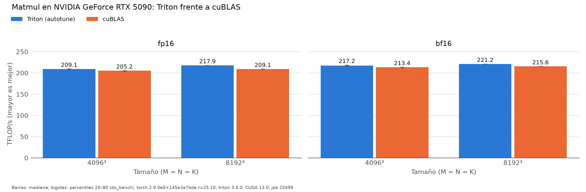

# Baseline matmul (pascal)

Generado automáticamente desde `results/pascal/run_matmul/20261002-091724_job20499/`.

| dtype | M×N×K | Config. Triton (BM×BN×BK, warps, stages) | Triton (ms) | Triton (TFLOP/s) | cuBLAS (ms) | cuBLAS (TFLOP/s) | Triton/cuBLAS |
|:---|:---|:---|---:|---:|---:|---:|---:|
| fp16 | 4096×4096×4096 | 128×64×32, w4, s3 | 0.657 | 209.1 | 0.670 | 205.2 | 101.9% |
| fp16 | 8192×8192×8192 | 256×128×64, w8, s3 | 5.046 | 217.9 | 5.257 | 209.1 | 104.2% |
| bf16 | 4096×4096×4096 | 128×64×64, w4, s3 | 0.633 | 217.2 | 0.644 | 213.4 | 101.8% |
| bf16 | 8192×8192×8192 | 128×128×32, w4, s4 | 4.972 | 221.2 | 5.101 | 215.6 | 102.6% |

*NVIDIA GeForce RTX 5090 (sm_120), torch 2.9.0a0+145a3a7bda.nv25.10, triton 3.8.0, CUDA 13.0; job 20499, 2026-10-02T09:17:24. Mediana de triton.testing.do_bench.*

Tensor cores (PTX Triton): `mma.sync.aligned.m16n8k16.row.col.f32.bf16.bf16.f32`, `mma.sync.aligned.m16n8k16.row.col.f32.f16.f16.f32`
