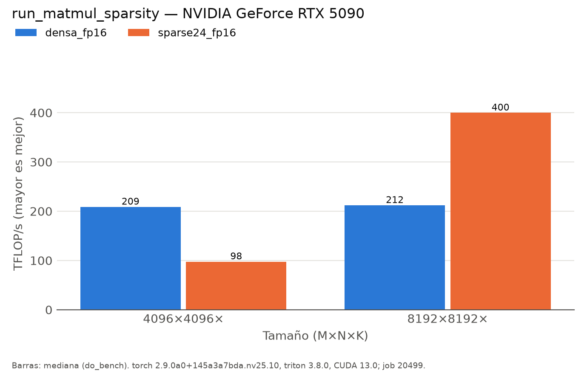

# run_matmul_sparsity (pascal)

Generado automáticamente desde `results/pascal/run_matmul_sparsity/20261002-091730_job20499/`.

| variante | M | N | K | error_rel | ms | ms_p20 | ms_p80 | tflops | kernel |
|:---|:---|:---|:---|:---|:---|:---|:---|:---|:---|
| densa_fp16 | 4096 | 4096 |  | 0 | 0.6584 | 0.6554 | 0.6595 | 208.75 | void cutlass::Kernel2<cutlass_80_tensorop_f16_s16816gemm_relu_f16_128x64_64x3_nn_align8>(cutlass_80_tensorop_f16_s16816gemm_relu_f16_128x64_64x3_nn_align8::Params) |
| sparse24_fp16 | 4096 | 4096 |  | 4e-05 | 1.407 | 1.2298 | 1.4975 | 97.68 | sm80_xmma_sparse_gemm_f16f16_f16f32_f32_tt_t_tilesize128x128x64_stage3_warpsize2x2x1_sptensor16x8x32_execute_kernel_5x_cusparselt |
| densa_fp16 | 8192 | 8192 |  | 0 | 5.1865 | 5.1683 | 5.1937 | 211.99 | void cutlass::Kernel2<cutlass_80_tensorop_f16_s16816gemm_relu_f16_128x64_64x3_nn_align8>(cutlass_80_tensorop_f16_s16816gemm_relu_f16_128x64_64x3_nn_align8::Params) |
| sparse24_fp16 | 8192 | 8192 |  | 6e-05 | 2.7505 | 2.7464 | 2.7536 | 399.75 | sm80_xmma_sparse_gemm_f16f16_f16f32_f32_tt_t_tilesize128x128x64_stage3_warpsize2x2x1_sptensor16x8x32_execute_kernel_5x_cusparselt |

*NVIDIA GeForce RTX 5090 (sm_120), torch 2.9.0a0+145a3a7bda.nv25.10, triton 3.8.0, CUDA 13.0; job 20499, 2026-10-02T09:17:30. Mediana de triton.testing.do_bench.*
