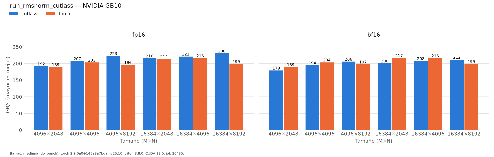

# run_rmsnorm_cutlass (patterson)

Generado automáticamente desde `results/patterson/run_rmsnorm_cutlass/20260930-164148_job20435/`.

| variante | dtype | M | N | ms | ms_p20 | ms_p80 | gbs | pct_pico | t_compilacion_s | detalle |
|:---|:---|:---|:---|:---|:---|:---|:---|:---|:---|:---|
| cutlass | fp16 | 4096 | 2048 | 0.1751 | 0.1741 | 0.1761 | 191.6 | 70.2 | 54.04 | rmsnorm_twoPassAlgo_e8 |
| torch | fp16 | 4096 | 2048 | 0.1772 | 0.1761 | 0.1782 | 189.4 | 69.4 |  |  |
| cutlass | fp16 | 4096 | 4096 | 0.3236 | 0.3226 | 0.3246 | 207.4 | 76 | 0 | rmsnorm_twoPassAlgo_e8 |
| torch | fp16 | 4096 | 4096 | 0.3306 | 0.3288 | 0.3318 | 203 | 74.4 |  |  |
| cutlass | fp16 | 4096 | 8192 | 0.6021 | 0.6011 | 0.6032 | 222.9 | 81.6 | 0 | rmsnorm_twoPassAlgo_e8 |
| torch | fp16 | 4096 | 8192 | 0.6851 | 0.683 | 0.6871 | 195.9 | 71.8 |  |  |
| cutlass | fp16 | 16384 | 2048 | 0.6226 | 0.6205 | 0.6236 | 215.6 | 79 | 0 | rmsnorm_twoPassAlgo_e8 |
| torch | fp16 | 16384 | 2048 | 0.6277 | 0.6267 | 0.6298 | 213.8 | 78.3 |  |  |
| cutlass | fp16 | 16384 | 4096 | 1.2135 | 1.2115 | 1.2156 | 221.2 | 81 | 0 | rmsnorm_twoPassAlgo_e8 |
| torch | fp16 | 16384 | 4096 | 1.2431 | 1.2411 | 1.2456 | 215.9 | 79.1 |  |  |
| cutlass | fp16 | 16384 | 8192 | 2.3297 | 2.3276 | 2.3327 | 230.5 | 84.4 | 0 | rmsnorm_twoPassAlgo_e8 |
| torch | fp16 | 16384 | 8192 | 2.7023 | 2.6984 | 2.7065 | 198.7 | 72.8 |  |  |
| cutlass | bf16 | 4096 | 2048 | 0.1874 | 0.1864 | 0.1894 | 179.1 | 65.6 | 0 | rmsnorm_twoPassAlgo_e1 |
| torch | bf16 | 4096 | 2048 | 0.1772 | 0.1761 | 0.1781 | 189.4 | 69.4 |  |  |
| cutlass | bf16 | 4096 | 4096 | 0.3451 | 0.343 | 0.3471 | 194.5 | 71.2 | 0 | rmsnorm_twoPassAlgo_e1 |
| torch | bf16 | 4096 | 4096 | 0.3298 | 0.3289 | 0.3316 | 203.5 | 74.5 |  |  |
| cutlass | bf16 | 4096 | 8192 | 0.6523 | 0.6503 | 0.6543 | 205.8 | 75.4 | 0 | rmsnorm_twoPassAlgo_e1 |
| torch | bf16 | 4096 | 8192 | 0.6798 | 0.6778 | 0.682 | 197.4 | 72.3 |  |  |
| cutlass | bf16 | 16384 | 2048 | 0.6697 | 0.6666 | 0.6728 | 200.4 | 73.4 | 0 | rmsnorm_twoPassAlgo_e1 |
| torch | bf16 | 16384 | 2048 | 0.6195 | 0.6185 | 0.6216 | 216.7 | 79.4 |  |  |
| cutlass | bf16 | 16384 | 4096 | 1.2933 | 1.2892 | 1.2984 | 207.6 | 76 | 0 | rmsnorm_twoPassAlgo_e1 |
| torch | bf16 | 16384 | 4096 | 1.2431 | 1.2411 | 1.2462 | 215.9 | 79.1 |  |  |
| cutlass | bf16 | 16384 | 8192 | 2.5375 | 2.5344 | 2.5411 | 211.6 | 77.5 | 0 | rmsnorm_twoPassAlgo_e1 |
| torch | bf16 | 16384 | 8192 | 2.7024 | 2.6976 | 2.7075 | 198.7 | 72.8 |  |  |

*NVIDIA GB10 (sm_121), torch 2.9.0a0+145a3a7bda.nv25.10, triton 3.8.0, CUDA 13.0; job 20435, 2026-09-30T16:41:48. Mediana de triton.testing.do_bench.*
