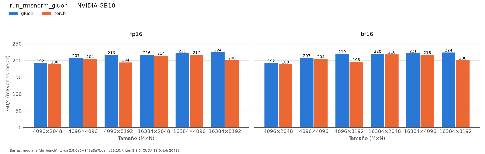

# run_rmsnorm_gluon (patterson)

Generado automáticamente desde `results/patterson/run_rmsnorm_gluon/20260930-155527_job20435/`.

| variante | dtype | M | N | ms | ms_p20 | ms_p80 | gbs | pct_pico | t_compilacion_s | detalle |
|:---|:---|:---|:---|:---|:---|:---|:---|:---|:---|:---|
| gluon | fp16 | 4096 | 2048 | 0.1751 | 0.174 | 0.1761 | 191.7 | 70.2 | 0.31 | num_warps=8 vec=8 |
| torch | fp16 | 4096 | 2048 | 0.1782 | 0.1772 | 0.1792 | 188.3 | 69 |  |  |
| gluon | fp16 | 4096 | 4096 | 0.3236 | 0.3226 | 0.3246 | 207.4 | 76 | 0.05 | num_warps=16 vec=8 |
| torch | fp16 | 4096 | 4096 | 0.3287 | 0.3277 | 0.3298 | 204.2 | 74.8 |  |  |
| gluon | fp16 | 4096 | 8192 | 0.6216 | 0.6205 | 0.6237 | 216 | 79.1 | 0.06 | num_warps=16 vec=8 |
| torch | fp16 | 4096 | 8192 | 0.6912 | 0.6892 | 0.6943 | 194.2 | 71.1 |  |  |
| gluon | fp16 | 16384 | 2048 | 0.6205 | 0.6195 | 0.6225 | 216.3 | 79.2 | 0 | num_warps=8 vec=8 |
| torch | fp16 | 16384 | 2048 | 0.6267 | 0.6247 | 0.6277 | 214.2 | 78.5 |  |  |
| gluon | fp16 | 16384 | 4096 | 1.2134 | 1.2114 | 1.2156 | 221.2 | 81 | 0 | num_warps=16 vec=8 |
| torch | fp16 | 16384 | 4096 | 1.238 | 1.236 | 1.2411 | 216.8 | 79.4 |  |  |
| gluon | fp16 | 16384 | 8192 | 2.3951 | 2.3921 | 2.3982 | 224.2 | 82.1 | 0 | num_warps=16 vec=8 |
| torch | fp16 | 16384 | 8192 | 2.6798 | 2.6757 | 2.6839 | 200.3 | 73.4 |  |  |
| gluon | bf16 | 4096 | 2048 | 0.1751 | 0.1741 | 0.1752 | 191.7 | 70.2 | 0.05 | num_warps=8 vec=8 |
| torch | bf16 | 4096 | 2048 | 0.1782 | 0.1772 | 0.1792 | 188.3 | 69 |  |  |
| gluon | bf16 | 4096 | 4096 | 0.3236 | 0.3226 | 0.3256 | 207.4 | 76 | 0.05 | num_warps=16 vec=8 |
| torch | bf16 | 4096 | 4096 | 0.3287 | 0.3277 | 0.3306 | 204.2 | 74.8 |  |  |
| gluon | bf16 | 4096 | 8192 | 0.6124 | 0.6114 | 0.6144 | 219.2 | 80.3 | 0.06 | num_warps=16 vec=8 |
| torch | bf16 | 4096 | 8192 | 0.6881 | 0.6861 | 0.6902 | 195.1 | 71.5 |  |  |
| gluon | bf16 | 16384 | 2048 | 0.6093 | 0.6083 | 0.6113 | 220.3 | 80.7 | 0 | num_warps=8 vec=8 |
| torch | bf16 | 16384 | 2048 | 0.6156 | 0.6146 | 0.6175 | 218 | 79.9 |  |  |
| gluon | bf16 | 16384 | 4096 | 1.2145 | 1.2134 | 1.2166 | 221 | 81 | 0 | num_warps=16 vec=8 |
| torch | bf16 | 16384 | 4096 | 1.24 | 1.237 | 1.2421 | 216.5 | 79.3 |  |  |
| gluon | bf16 | 16384 | 8192 | 2.3982 | 2.3951 | 2.4003 | 223.9 | 82 | 0 | num_warps=16 vec=8 |
| torch | bf16 | 16384 | 8192 | 2.6829 | 2.6789 | 2.688 | 200.1 | 73.3 |  |  |

*NVIDIA GB10 (sm_121), torch 2.9.0a0+145a3a7bda.nv25.10, triton 3.8.0, CUDA 13.0; job 20435, 2026-09-30T15:55:27. Mediana de triton.testing.do_bench.*
