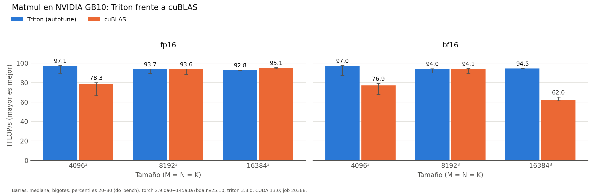

# Baseline matmul

Generado automáticamente desde `results/run_matmul/20260929-095407_job20388/`.

| dtype | M×N×K | Config. Triton (BM×BN×BK, warps, stages) | Triton (ms) | Triton (TFLOP/s) | cuBLAS (ms) | cuBLAS (TFLOP/s) | Triton/cuBLAS |
|:---|:---|:---|---:|---:|---:|---:|---:|
| fp16 | 4096×4096×4096 | 128×128×32, w4, s3 | 1.415 | 97.1 | 1.755 | 78.3 | 124.0% |
| fp16 | 8192×8192×8192 | 128×256×64, w8, s3 | 11.733 | 93.7 | 11.743 | 93.6 | 100.1% |
| fp16 | 16384×16384×16384 | 256×128×64, w8, s3 | 94.784 | 92.8 | 92.532 | 95.1 | 97.6% |
| bf16 | 4096×4096×4096 | 128×128×32, w4, s3 | 1.417 | 97.0 | 1.786 | 76.9 | 126.1% |
| bf16 | 8192×8192×8192 | 128×256×64, w8, s3 | 11.691 | 94.0 | 11.687 | 94.1 | 100.0% |
| bf16 | 16384×16384×16384 | 256×128×64, w8, s3 | 93.071 | 94.5 | 141.925 | 62.0 | 152.5% |

*NVIDIA GB10 (sm_121), torch 2.9.0a0+145a3a7bda.nv25.10, triton 3.8.0, CUDA 13.0; job 20388, 2026-09-29T09:54:07. Mediana de triton.testing.do_bench.*

Tensor cores (PTX Triton): `mma.sync.aligned.m16n8k16.row.col.f32.bf16.bf16.f32`, `mma.sync.aligned.m16n8k16.row.col.f32.f16.f16.f32`
