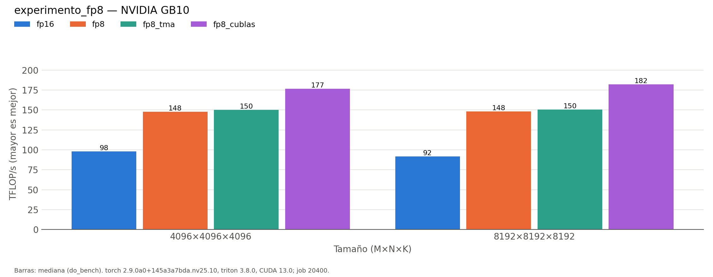

# run_matmul_fp8

Generado automáticamente desde `results/run_matmul_fp8/20260929-212712_job20400/`.

| variante | M | N | K | BLOCK_SIZE_M | BLOCK_SIZE_N | BLOCK_SIZE_K | GROUP_SIZE_M | num_warps | num_stages | carga | error_rel | ms | ms_p20 | ms_p80 | tflops | gbs | mma |
|:---|:---|:---|:---|:---|:---|:---|:---|:---|:---|:---|:---|:---|:---|:---|:---|:---|:---|
| fp16 | 4096 | 4096 | 4096 | 128 | 128 | 32 | 8 | 4 | 4 | cp.async | 0.00021 | 1.4029 | 1.3988 | 1.5135 | 97.97 | 71.8 | mma.sync.aligned.m16n8k16.row.col.f32.f16.f16.f32 |
| fp8 | 4096 | 4096 | 4096 | 256 | 128 | 128 | 8 | 8 | 3 | cp.async | 0.03752 | 0.9308 | 0.9268 | 0.9817 | 147.65 | 72.1 | mma.sync.aligned.m16n8k32.row.col.f32.e4m3.e4m3.f32 |
| fp8_tma | 4096 | 4096 | 4096 | 128 | 128 | 64 | 8 | 4 | 4 | TMA | 0.03752 | 0.9155 | 0.914 | 0.9217 | 150.12 | 73.3 | mma.sync.aligned.m16n8k32.row.col.f32.e4m3.e4m3.f32 |
| fp8_cublas | 4096 | 4096 | 4096 |  |  |  |  |  |  | cublasLt | 0.03752 | 0.778 | 0.7731 | 0.8456 | 176.65 | 86.3 | cublasLt |
| fp16 | 8192 | 8192 | 8192 | 128 | 256 | 64 | 8 | 8 | 3 | cp.async | 0.00021 | 12.0077 | 11.7957 | 12.3292 | 91.57 | 33.5 | mma.sync.aligned.m16n8k16.row.col.f32.f16.f16.f32 |
| fp8 | 8192 | 8192 | 8192 | 256 | 128 | 128 | 8 | 8 | 3 | cp.async | 0.03755 | 7.4137 | 7.3892 | 7.7379 | 148.31 | 36.2 | mma.sync.aligned.m16n8k32.row.col.f32.e4m3.e4m3.f32 |
| fp8_tma | 8192 | 8192 | 8192 | 256 | 128 | 128 | 8 | 8 | 3 | TMA | 0.03755 | 7.3068 | 7.2888 | 7.6942 | 150.48 | 36.7 | mma.sync.aligned.m16n8k32.row.col.f32.e4m3.e4m3.f32 |
| fp8_cublas | 8192 | 8192 | 8192 |  |  |  |  |  |  | cublasLt | 0.03755 | 6.0305 | 5.9846 | 6.4752 | 182.33 | 44.5 | cublasLt |

*NVIDIA GB10 (sm_121), torch 2.9.0a0+145a3a7bda.nv25.10, triton 3.8.0, CUDA 13.0; job 20400, 2026-09-29T21:27:12. Mediana de triton.testing.do_bench.*
