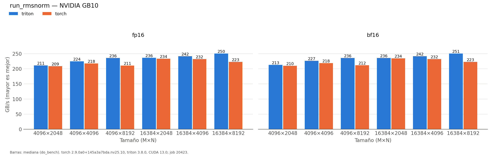

# run_rmsnorm_triton

Generado automáticamente desde `results/run_rmsnorm_triton/20260930-142353_job20423/`.

| variante | dtype | M | N | ms | ms_p20 | ms_p80 | gbs | pct_pico |
|:---|:---|:---|:---|:---|:---|:---|:---|:---|
| triton | fp16 | 4096 | 2048 | 0.1588 | 0.1585 | 0.1598 | 211.4 | 77.4 |
| torch | fp16 | 4096 | 2048 | 0.1607 | 0.1597 | 0.1618 | 208.8 | 76.5 |
| triton | fp16 | 4096 | 4096 | 0.2991 | 0.298 | 0.3011 | 224.4 | 82.2 |
| torch | fp16 | 4096 | 4096 | 0.3082 | 0.3072 | 0.3102 | 217.8 | 79.8 |
| triton | fp16 | 4096 | 8192 | 0.5691 | 0.5673 | 0.5704 | 235.9 | 86.4 |
| torch | fp16 | 4096 | 8192 | 0.6369 | 0.6339 | 0.64 | 210.8 | 77.2 |
| triton | fp16 | 16384 | 2048 | 0.5675 | 0.5662 | 0.5693 | 236.5 | 86.6 |
| torch | fp16 | 16384 | 2048 | 0.5745 | 0.5733 | 0.5775 | 233.6 | 85.6 |
| triton | fp16 | 16384 | 4096 | 1.111 | 1.1089 | 1.1141 | 241.6 | 88.5 |
| torch | fp16 | 16384 | 4096 | 1.1571 | 1.1538 | 1.1612 | 232 | 85 |
| triton | fp16 | 16384 | 8192 | 2.1432 | 2.1393 | 2.1473 | 250.5 | 91.8 |
| torch | fp16 | 16384 | 8192 | 2.4074 | 2.3976 | 2.4214 | 223 | 81.7 |
| triton | bf16 | 4096 | 2048 | 0.1577 | 0.1567 | 0.1588 | 212.8 | 77.9 |
| torch | bf16 | 4096 | 2048 | 0.1597 | 0.1588 | 0.1608 | 210.1 | 77 |
| triton | bf16 | 4096 | 4096 | 0.2962 | 0.2958 | 0.298 | 226.6 | 83 |
| torch | bf16 | 4096 | 4096 | 0.3072 | 0.3062 | 0.3091 | 218.5 | 80 |
| triton | bf16 | 4096 | 8192 | 0.5693 | 0.5674 | 0.5704 | 235.8 | 86.4 |
| torch | bf16 | 4096 | 8192 | 0.6333 | 0.6289 | 0.638 | 211.9 | 77.6 |
| triton | bf16 | 16384 | 2048 | 0.5691 | 0.5673 | 0.5714 | 235.9 | 86.4 |
| torch | bf16 | 16384 | 2048 | 0.5724 | 0.5704 | 0.5744 | 234.5 | 85.9 |
| triton | bf16 | 16384 | 4096 | 1.111 | 1.108 | 1.1141 | 241.6 | 88.5 |
| torch | bf16 | 16384 | 4096 | 1.1561 | 1.1531 | 1.1603 | 232.2 | 85.1 |
| triton | bf16 | 16384 | 8192 | 2.1422 | 2.1399 | 2.1504 | 250.6 | 91.8 |
| torch | bf16 | 16384 | 8192 | 2.4075 | 2.3972 | 2.422 | 223 | 81.7 |

*NVIDIA GB10 (sm_121), torch 2.9.0a0+145a3a7bda.nv25.10, triton 3.8.0, CUDA 13.0; job 20423, 2026-09-30T14:23:53. Mediana de triton.testing.do_bench.*
