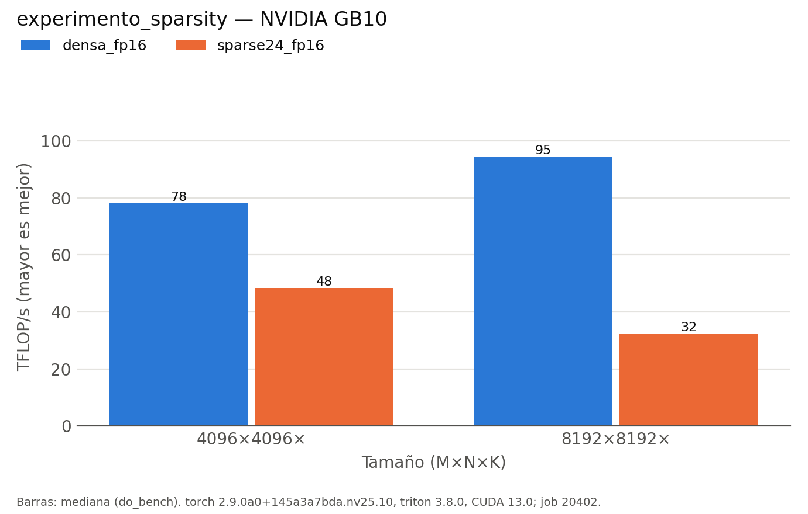

# Estructura dispersa 2:4 en los tensor cores

*Sección consolidada para la memoria del TFM. Datos: `results/run_matmul_sparsity/ultimo/` (job 20402). Hardware: NVIDIA GB10 (sm_121), torch 2.9, triton 3.8.0, CUDA 13.0.*

## Motivación

La cifra de catálogo de esta clase de GPU (~838 TFLOPS) es un número **con sparsity 2:4**: de cada 4 valores, 2 son cero, la matriz se comprime a la mitad + metadatos, y el circuito sparse del tensor core duplica el throughput saltándose los ceros. Es, en teoría, la única técnica capaz de superar el techo denso. Se estudia si en GB10, con el *stack* disponible, ese 2× es alcanzable.

## Implementación

Triton **no** soporta 2:4 en `tl.dot` (no acepta los metadatos de sparsity), así que se usa la ruta de PyTorch: se poda A al patrón 2:4 (en cada grupo de 4 a lo largo de K se conservan los 2 de mayor magnitud), se comprime con `torch.sparse.to_sparse_semi_structured` (backend **cuSPARSELt**) y se mide `A_sp @ B`. Se compara con el denso `torch.matmul` de las mismas matrices. El rendimiento se da en convención *dense-equivalent* ($2MNK/t$): un 2× real aparecería como ~2× TFLOP/s.

## Resultados

| tamaño | denso fp16 | 2:4 sparse fp16 | sparse/denso | kernel denso | kernel sparse |
|:---|---:|---:|---:|:---|:---|
| 4096³ | 78.1 | 48.3 | **61.9 %** | `cutlass_80_tensorop` | `sm80_xmma_sparse_gemm` |
| 8192³ | 94.6 | 32.3 | **34.2 %** | `nvjet_sm121_..._tmaAB` | `sm80_xmma_sparse_gemm` |

*FP8 + 2:4: `NotImplementedError` (no soportado por la API; sugiere `torch._scaled_mm`). Error del camino sparse vs denso-podado: ~0 %.*

## Análisis crítico

1. **El 2:4 no acelera; ralentiza.** El GEMM sparse rinde solo el 34–62 % del denso, lo contrario del 2× teórico.
2. **La causa es la ausencia de kernel sparse nativo para Blackwell.** cuSPARSELt despacha a `sm80_xmma_sparse_gemm`, un kernel de **Ampère (sm_80)**, que no explota sm_121. En cambio, el denso a 8192³ usa un kernel **nativo** `nvjet_sm121_..._tmaAB` (Blackwell + TMA); el sparse compite con hardware de dos generaciones atrás y pierde.
3. **FP8 + 2:4 no es accesible** por la API de semi-structured (`mm is not supported for float8_e4m3fn`): la combinación que daría la cifra de catálogo exigiría bajar a cuSPARSELt directamente, fuera del alcance de este trabajo.
4. **El número de catálogo no es reproducible aquí.** Los ~838 TFLOPS presuponen kernels sparse específicos de la arquitectura (y precisión FP8/FP4) que este *stack* (torch 2.9 / cuSPARSELt) todavía no expone para sm_121.

## Conclusión

En GB10 con el *stack* actual, la estructura dispersa 2:4 es una **regresión de rendimiento**, no una mejora, por falta de kernel sparse nativo de Blackwell; y la variante FP8+2:4 —la que daría la cifra de catálogo— no está soportada. La mejor palanca real sigue siendo el **FP8 denso** (§ [docs/TFM/fp8.md](fp8.md)): 150 TFLOP/s en Triton y hasta 192 en cuBLASLt, frente a ~92 en FP16. La sparsity 2:4 queda como línea a revisar cuando el *stack* incorpore kernels sparse para sm_121.

**Reproducir:** `bash ~/hennessy/tfm_entorno/ejecutar.sh encolar exp run_matmul_sparsity --sizes 4096 8192`
