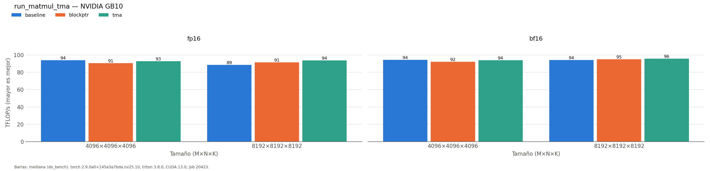

# Aceleración de la carga de datos: TMA en Triton

*Sección consolidada para la memoria del TFM. Datos: `results/hennessy-580/run_matmul_tma/20260929-205626_job20398/` (job 20398). Hardware: NVIDIA GB10 (sm_121), torch 2.9, triton 3.8.0, CUDA 13.0.*

## Motivación

El baseline en Triton alcanza ~90 TFLOP/s en `8192³` (fp16), pegado a la barrera de los ~100 TFLOP/s. Una hipótesis habitual es que el cuello está en el **movimiento de datos**: las cargas estándar (`tl.load` sobre punteros calculados) ocupan los registros y los hilos del *Streaming Multiprocessor* (SM) en gestionar la memoria. En arquitecturas sm_90 en adelante existe el **TMA** (*Tensor Memory Accelerator*), hardware dedicado que mueve bloques VRAM→SRAM de forma asíncrona **sin pasar por los registros**, liberando al SM para que se concentre en multiplicar. Se estudia si activar TMA en el kernel de matmul supera esa barrera.

## Dos intentos de activar TMA

Se implementan dos variantes del kernel, idénticas al baseline salvo en la estrategia de carga (mismo *swizzling* L2, mismo `tl.dot` con acumulación fp32), y se compara con la misma metodología (`triton.testing.do_bench`, mediana). La activación de TMA se **verifica en el PTX**: se considera que hay TMA si aparece la instrucción `cp.async.bulk.tensor` (`comun.copias_asincronas`).

### Intento 1 — *block-pointers* (`tl.make_block_ptr` + `tl.advance`)

Es la abstracción de alto nivel que la documentación asocia a TMA. Resultado:

- En el PTX **no** aparece `cp.async.bulk.tensor`, sino `cp.async` clásico → **TMA no se activa** (`carga=cp.async`, `usa_tma=False`).
- Triton 3.8 marca además esta API como **deprecada**: *"tl.make_block_ptr is deprecated. Use TensorDescriptor or tl.make_tensor_descriptor instead"*.

Es decir, la abstracción del compilador **no se traduce en el hardware esperado** sin la sintaxis correcta.

### Intento 2 — descriptores de tensor (`tl.make_tensor_descriptor`)

La API que sí emite TMA es la de **descriptores de tensor**, creados dentro del kernel con `tl.make_tensor_descriptor` (compatible con `@triton.autotune` al ser el `block_shape` un `constexpr`) y cargados con `desc.load([fila, col])`. Los descriptores *on-device* requieren memoria *scratch*, que se reserva registrando un *allocator* global con `triton.set_allocator`. Resultado:

- En el PTX aparece `cp.async.bulk.tensor` → **TMA activado** (`carga=TMA`, `usa_tma=True`).
- TMA gestiona el fuera-de-rango rellenando con ceros, así que se eliminan las máscaras manuales.

## Resultados

| variante | TFLOP/s | GB/s | `carga=` | vs baseline |
|:---|---:|---:|:---|---:|
| baseline | 90.81 | 33.3 | cp.async | — |
| blockptr | 92.82 | 34.0 | cp.async | +2.2 % |
| **tma** | 92.71 | 34.0 | **TMA** | +2.1 % |

*`8192×8192×8192`, fp16. MMA en las tres: `mma.sync.aligned.m16n8k16`. Tabla completa: `resultados/hennessy-580/run_matmul_tma.md`.*

## Análisis crítico

1. **Activar TMA es una cuestión de sintaxis, no de intención.** El *block-pointer* (deprecado) baja a `cp.async`; solo la API de descriptores emite `cp.async.bulk.tensor`. Verificarlo exige inspeccionar el PTX, no basta con usar la abstracción.
2. **Activar TMA no da aceleración** aquí: el paso a TMA correcto sube el rendimiento un ~2 %, dentro del ruido de medida (los percentiles p20–p80 se solapan). La razón es que el matmul denso a este tamaño **no está limitado por la memoria**: el ancho de banda efectivo (~34 GB/s) es bajísimo precisamente porque los datos se reutilizan intensamente en SRAM, y TMA solo optimiza el transporte de datos. El cuello está en el **cómputo**.
3. **El techo lo marca la unidad MMA de sm_121.** En GB10 Triton emite `mma.sync.m16n8k16` (la MMA de sm_80), no `wgmma` (sm_90a) ni `tcgen05.mma` (sm_100a). Con matmul denso fp16 no hay palanca por el lado de la carga; la única vía para subir el techo de los tensor cores en esta GPU es **reducir la precisión** (fp8) o **estructura dispersa 2:4**.

## Conclusión

TMA queda **correctamente activado y verificado** en el kernel de descriptores, pero es una condición **necesaria y no suficiente**: no acelera el matmul denso fp16 porque el límite no es la memoria sino la unidad MMA. Se conserva como infraestructura para los experimentos de menor precisión / *sparsity*, donde el kernel sí puede volverse *memory-bound* y el transporte por TMA sí puede rendir. El intento fallido con *block-pointers* se documenta y conserva (`src/CBKernels/triton/matmul_blockptr.py`) como evidencia de que las abstracciones del compilador no garantizan el uso del hardware.

**Reproducir:** `bash ~/hennessy/tfm_entorno/ejecutar.sh encolar exp run_matmul_tma --sizes 8192 --dtypes fp16`
